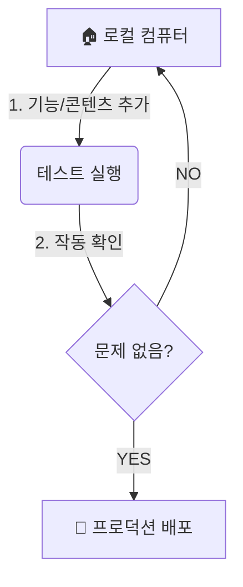

# 🛡️ 안전한 작업 흐름 가이드 (Workflow Guide)

이 문서는 개발자가 아닌 운영자(원장님, 매니저)가 Gemini CLI AI를 활용해 기능을 추가하거나 콘텐츠를 만들 때, **안전하게 작업을 진행하는 절차**를 설명합니다.

---

## 🚦 핵심 원칙: "로컬에서 먼저, 그 다음 프로덕션"

프로덕션(실제 운영 서버)은 환자들이 보고 있는 **라이브 환경**입니다. 사소한 실수로 예약이 안 되거나 화면이 깨지는 것을 막기 위해, 우리는 **'안전장치(Local)'**를 거쳐서 작업합니다.

### ✅ 안전한 작업 순서 (Workflow)

---

## 1. 🏠 로컬 작업 (Sandbox)
**"여기서는 무엇을 해도 안전합니다."**
로컬 환경(`localhost`)은 나만 볼 수 있는 연습장입니다. 데이터를 지우거나 코드를 망가뜨려도 실제 환자들에겐 아무런 영향이 없습니다.

*   **Gemini CLI에게 요청하기**: "새로운 다이어트 프로그램 페이지 만들어줘", "환자 목록에 나이 필드 추가해줘"
*   **테스트**: `npm run dev`를 켜고 브라우저에서 직접 눌러보세요.
*   **데이터 실험**: 가짜 환자 정보를 마음껏 넣고 지워보세요.

---

## 2. 🔍 검증 (Verification)
배포하기 전, 딱 3가지만 확인하세요.

1.  **화면이 뜨는가?**: 흰 화면(에러)이 뜨지 않는지.
2.  **데이터가 저장되는가?**: 입력한 내용이 새로고침 후에도 남아있는지.
3.  **기존 기능**: 내가 건드리지 않은 다른 중요 기능(예: 예약하기)이 잘 되는지.

---

## 3. 🚀 프로덕션 적용 (Promotion)

로컬에서 확인이 끝났다면, 이제 세상에 공개할 차례입니다. 작업의 종류에 따라 적용 방법이 다릅니다.

### A. 디자인/기능을 고쳤을 때 (Code Change)
화면의 레이아웃, 버튼 색상, 새로운 페이지 추가 등 **'눈에 보이는 코드'**를 수정했을 때입니다.
*   **명령어**: `npm run deploy`
*   **설명**: 내 컴퓨터의 코드를 서버로 복사합니다.

### B. 데이터 구조를 고쳤을 때 (Schema Change)
"환자 테이블에 '혈액형' 칸을 추가했다"와 같이 **'정보의 구조'**가 바뀌었을 때입니다.
*   **명령어**: `npm run db:push` (개발 예정 기능) 또는 `npx wrangler d1 migrations apply`
*   **주의**: 이 작업은 신중해야 합니다. 데이터 구조가 바뀌면 기존 데이터와 충돌이 날 수 있습니다. **반드시 백업 후 진행하세요.**

### C. 콘텐츠만 추가했을 때 (Content)
블로그 글, 팝업 공지사항 등 단순 글쓰기입니다.
*   **방법**: 배포할 필요 없이, **프로덕션 관리자 페이지**에 접속해서 직접 글을 쓰는 것이 가장 좋습니다. 로컬에서 굳이 옮길 필요가 없습니다.

---

## ⛔ 절대 하지 말아야 할 것 (Danger Zone)

1.  **프로덕션 DB 직접 삭제**: 클라우드플레어 콘솔에서 `DROP TABLE` 등을 실수로 누르면 복구가 매우 어렵습니다.
2.  **테스트 없이 배포**: "간단한 거니까 그냥 올려도 되겠지?" -> 가장 사고가 많이 나는 원인입니다.
3.  **로컬/프로덕션 혼동**: 항상 주소창이 `localhost`인지 `my-clinic.com`인지 확인하세요.

---

## 💡 요약
1.  **Gemini CLI와 작업할 땐 항상 로컬에서 시작하세요.**
2.  **테스트가 끝나면 명령어(`npm run deploy`) 한 번으로 배포하세요.**
3.  **데이터 구조(Schema) 변경은 신중하게, 콘텐츠(글)는 관리자 페이지에서 하세요.**
