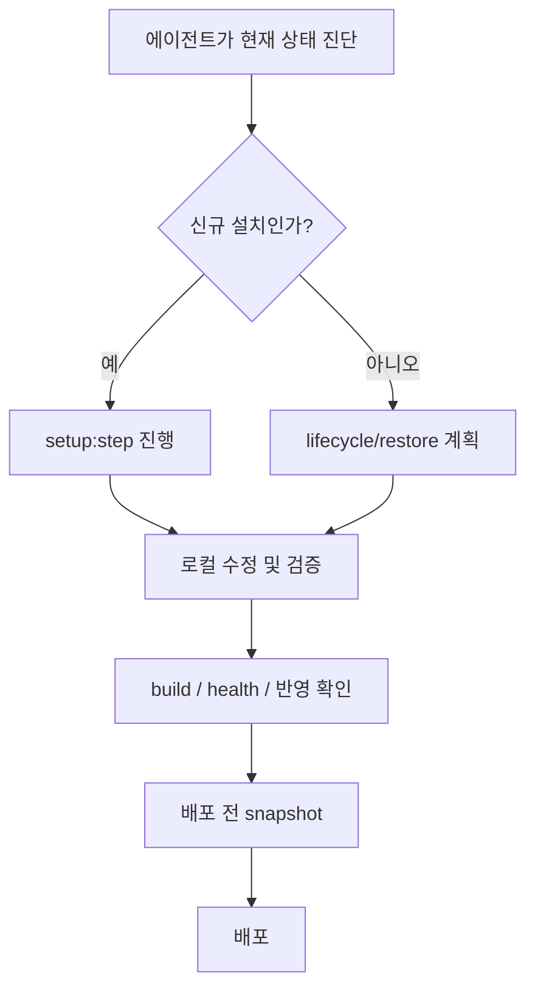

# 안전한 작업 흐름 가이드

이 문서는 개발자가 아닌 운영자와 에이전트가 Clinic-OS를 안전하게 다루기 위한 기본 작업 순서를 설명합니다.

핵심 원칙은 하나입니다.

**로컬에서 진단하고, 보호 스냅샷을 만들고, 검증 후에 배포한다.**

## 역할 분담

| 주체 | 역할 |
|------|------|
| 사용자 | 목표 설명, 정보 제공, 승인 |
| 에이전트 | 진단, 작업 경로 선택, 수정, 검증, 배포 준비 |

사용자는 명령어를 외우는 대신 결과를 검토하면 됩니다.

## 기본 흐름


```mermaid
graph TD
    A[에이전트가 현재 상태 진단] --> B{신규 설치인가?}
    B -->|예| C[setup:step 진행]
    B -->|아니오| D[lifecycle/restore 계획]
    C --> E[로컬 수정 및 검증]
    D --> E
    E --> F[build / health / 반영 확인]
    F --> G[배포 전 snapshot]
    G --> H[배포]
```

## 1. 시작은 항상 진단

에이전트는 바로 수정하거나 배포하지 말고 먼저 아래를 봐야 합니다.

- `npm run agent:doctor -- --json`
- `npm run agent:lifecycle -- --json`

여기서 결정해야 하는 것은 보통 세 가지입니다.

1. 신규 설치인지
2. 기존 설치 이관이 필요한지
3. 지금 손대려는 작업이 로컬 커스터마이징인지 중앙 패치인지

## 2. 위험한 작업 전에는 보호 스냅샷

아래 상황이면 snapshot이 기본입니다.

- `core:pull` 전
- 새 starter-kit으로 이관 전
- 배포 대상 연결을 바꾸기 전
- DB/스토리지 연결이 달라질 수 있는 작업 전

에이전트는 보통 아래를 사용해야 합니다.

```bash
npm run agent:snapshot -- --reason=manual
```

## 3. 수정은 로컬에서 먼저

퍼블릭 페이지, 관리자 설정, 플러그인, 배포 설정 모두 로컬에서 먼저 확인합니다.

에이전트가 해야 할 검증 예:

- 관리자에서 수정한 값이 퍼블릭에 반영되는지
- 이미지/정적 파일이 깨지지 않는지
- 기존 핵심 기능이 회귀하지 않는지
- 빌드가 되는지

## 4. 배포는 검증 후

배포 전 최소 체크:

1. `npm run build`
2. 필요 시 `npm run health`
3. 보호 스냅샷 존재 여부 확인
4. 배포 대상 연결 확인

## 5. 좋은 에이전트 행동

좋은 예:

- "현재 설치본은 구형이라 인플레이스 업데이트보다 재설치 이관이 안전합니다."
- "배포 전에 snapshot을 만들고 현재 Pages/D1/R2 연결을 점검하겠습니다."
- "관리자 변경이 퍼블릭에 반영되는지 로컬에서 먼저 확인하겠습니다."

좋지 않은 예:

- "`npm run setup` 먼저 쳐보세요"
- "`core:pull` 한번 돌려보죠"
- "자동 리빌드/비대화형 경로로 먼저 처리하겠습니다."

## 6. 콘텐츠와 코드의 구분

### 콘텐츠

단순 텍스트, 공지, 일부 설정 값은 관리자에서 수정하는 편이 낫습니다.

### 코드

아래는 에이전트가 코드 작업으로 처리해야 합니다.

- 퍼블릭 페이지 구조 변경
- 관리자 변경이 퍼블릭에 반영되지 않는 버그
- 플러그인 개발/설치/제출
- 중앙 패치가 필요한 코어 문제

## 7. 특히 조심할 상황

| 상황 | 에이전트 우선 행동 |
|------|--------------------|
| 예전 설치본을 계속 쓰고 있음 | `agent:lifecycle` 로 재설치 이관 여부 판단 |
| 업데이트 후 작업물이 사라졌다고 느낌 | 연결 대상, local 폴더, restore 후보, DB/R2 대상 확인 |
| 관리자 수정이 퍼블릭에 안 보임 | 설정 저장 경로와 퍼블릭 소비 경로를 모두 추적 |
| 플러그인 설치 후 안 보임 | rebuild 필요 여부와 installed status 확인 |

## 다음 문서

- [온보딩 가이드](./ONBOARDING.md)
- [플러그인 개발 가이드](./PLUGIN_DEVELOPMENT_GUIDE.md)
- [운영 가이드](./OPERATIONS_GUIDE.md)
