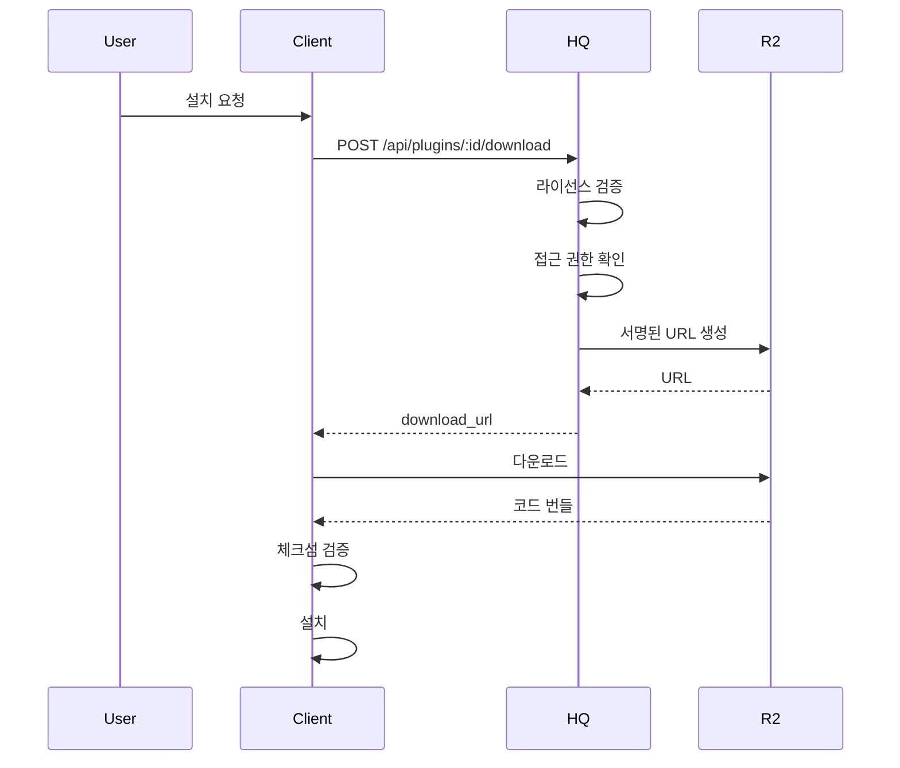

# SPEC-PLUGIN-MARKETPLACE-001: Implementation Plan

## TAG BLOCK

```
TAG: SPEC-PLUGIN-MARKETPLACE-001
TYPE: feature
DOMAIN: plugin-marketplace
STATUS: planned
PRIORITY: high
PHASE: plan
```

## Implementation Milestones

### Primary Goal (MVP)

개발자가 플러그인을 제출하고, 관리자가 리뷰하며, 사용자가 설치할 수 있는 기본 마켓플레이스 기능 구현.

**필수 기능:**
- 개발자 제출 시스템
- 관리자 리뷰 워크플로우
- 공개 스토어 조회
- 클라이언트 설치/제거

### Secondary Goal

유료 플러그인 지원, 업데이트 시스템, 통계 대시보드.

**확장 기능:**
- 라이선스 기반 접근 제어
- 자동 업데이트 알림
- 사용자 평점 및 리뷰
- 개발자 수익 대시보드

### Optional Goal

고급 분석, 추천 시스템, A/B 테스트 지원.

## Technical Approach

### Phase 1: 백엔드 인프라 (Priority: High)

**1.1 데이터베이스 마이그레이션**

```sql
-- hq/migrations/0007_add_plugin_marketplace.sql

-- 제출 로그 테이블
CREATE TABLE IF NOT EXISTS plugin_submissions (...);

-- 다운로드 로그 테이블
CREATE TABLE IF NOT EXISTS plugin_downloads (...);

-- 위반 보고 테이블
CREATE TABLE IF NOT EXISTS plugin_violations (...);
```

**1.2 HQ API 엔드포인트 구현**

```javascript
// hq/src/handlers/plugin-submissions.js
export async function handlePluginSubmission(request, env, corsHeaders) {
  // 1. JWT 인증 확인
  // 2. 개발자 등급 확인
  // 3. manifest.json 검증
  // 4. 보안 스캔 실행
  // 5. R2 스토리지에 코드 업로드
  // 6. plugin_submissions 레코드 생성
  // 7. plugin_versions 레코드 생성 (review_status='pending')
}

// hq/src/handlers/plugin-downloads.js
export async function handlePluginDownload(request, env, pluginId, corsHeaders) {
  // 1. 플러그인 접근 권한 확인
  // 2. 라이선스 검증 (유료 플러그인)
  // 3. 다운로드 로그 기록
  // 4. R2 서명된 URL 생성
}

// hq/src/handlers/plugin-install.js
export async function handlePluginInstall(request, env, corsHeaders) {
  // 1. 클라이언트 인증
  // 2. 플러그인 상태 확인
  // 3. 권한 동의 확인
  // 4. plugin_installs 레코드 생성
  // 5. 설치 토큰 발급
}
```

**1.3 보안 검증 시스템**

```javascript
// hq/src/lib/plugin-validator.js
export class PluginValidator {
  static validateManifest(manifest) { /* ... */ }
  static async scanSecurity(codeBundle) { /* ... */ }
  static async verifyPermissions(permissions) { /* ... */ }
  static generateChecksum(bundle) { /* ... */ }
}
```

### Phase 2: 관리자 인터페이스 (Priority: High)

**2.1 리뷰 대시보드**

```
/admin/hub/plugin-marketplace/reviews
├── 대기열 목록 (신뢰 등급별 정렬)
├── 제출 상세 뷰
├── 코드 리뷰 인터페이스
└── 승인/거부 액션
```

**2.2 제출 상세 페이지**

- 매니페스트 정보 표시
- 보안 스캔 결과 요약
- 코드 diff 뷰어 (이전 버전과 비교)
- 개발자 정보 (신뢰 등급, 이전 제출 이력)

**2.3 승인/거부 워크플로우**

```typescript
// components/PluginReviewActions.tsx
interface ReviewActions {
  onApprove: (feedback?: string) => void;
  onReject: (reason: string) => void;
  onRequestChanges: (requested: string[]) => void;
}
```

### Phase 3: 공개 스토어 (Priority: Medium)

**3.1 스토어 프론트엔드**

```
/plugins/store
├── 카테고리 필터
├── 검색바
├── 플러그인 카드 그리드
└── 무한 스크롤/페이지네이션
```

**3.2 플러그인 상세 페이지**

```
/plugins/store/:id
├── 스크린샷 갤러리
├── 설명 및 기능 목록
├── 권한 요구사항
├── 사용자 평점/리뷰
├── 개발자 정보
└── 설치 버튼
```

**3.3 검색 및 필터링**

```typescript
// lib/plugin-store.ts
export interface StoreFilters {
  category?: string;
  search?: string;
  accessType?: 'public' | 'restricted';
  pricingType?: 'free' | 'paid' | 'freemium';
  minRating?: number;
}

export async function searchPlugins(filters: StoreFilters) {
  // D1 쿼리 빌더
  // 전체 텍스트 검색 (FTS5)
  // 필터 적용
  // 결과 반환
}
```

### Phase 4: 클라이언트 설치 (Priority: High)

**4.1 설치 관리자**

```typescript
// src/lib/plugin-installer.ts
export class PluginInstaller {
  async install(pluginId: string, version: string): Promise<void> {
    // 1. 다운로드 URL 획득
    // 2. 코드 번들 다운로드
    // 3. 체크섬 검증
    // 4. 압축 해제 to src/plugins/local/
    // 5. 설치 기록
    // 6. 활성화
  }

  async update(installId: string): Promise<void> {
    // 1. 새 버전 확인
    // 2. 백업 생성
    // 3. 새 버전 다운로드 및 설치
    // 4. 롤백 지원
  }

  async uninstall(installId: string): Promise<void> {
    // 1. 플러그인 비활성화
    // 2. 파일 삭제
    // 3. 설치 기록 삭제
  }
}
```

**4.2 설치 UI**

```astro
<!-- src/pages/admin/hub/plugin-marketplace/install.astro -->
<PluginInstallWizard>
  <StepPermissionReview>
    <!-- 요청 권한 목록 -->
  </StepPermissionReview>
  <StepConfirm>
    <!-- 설치 확인 -->
  </StepConfirm>
  <StepProgress>
    <!-- 다운로드/설치 진행률 -->
  </StepProgress>
</PluginInstallWizard>
```

### Phase 5: 개발자 도구 (Priority: Medium)

**5.1 제출 CLI**

```bash
# CLI 도구 설치
npm install -g @clinic-os/plugin-cli

# 플러그인 패키징
clinic-plugin package ./plugins/my-plugin

# 제출
clinic-plugin submit ./plugins/my-plugin \
  --version 1.0.0 \
  --api-key $CLINIC_OS_API_KEY
```

**5.2 개발자 포털**

```
/plugins/developer
├── 내 플러그인 관리
├── 제출 현황 추적
├── 다운로드 통계
├── 수익 대시보드 (유료)
└── 리뷰 피드백
```

## Architecture Decisions

### R2 스토리지 구조

```
plugin-bucket/
├── plugins/{plugin_id}/
│   ├── {plugin_id}-{version}.zip     # 코드 번들
│   ├── {plugin_id}-{version}.checksum # SHA256 체크섬
│   └── screenshots/
│       └── {screenshot_id}.png
└── submissions/
    └── {submission_id}/
        ├── manifest.json
        └── code.zip
```

### 권한 검증 흐름



### 보안 샌드박싱 전략

1. **Permission Whitelist**: 선언된 권한만 허용
2. **Network Isolation**: 내부 네트워크 차단
3. **Storage Segregation**: 플러그인 전용 D1 테이블
4. **Execution Timeout**: 무한 루프 방지
5. **Memory Limits**: 메모리 사용량 제한

## Risks and Mitigation

| 리스크 | 영향도 | 완화책 |
|--------|--------|--------|
| 악성 플러그인 배포 | Critical | 다단계 검증, 샌드박스, 위반 보고 시스템 |
| R2 스토리지 비용 | Medium | 압축, 만료 정책, CDN 캐싱 |
| 저작권 침해 | High | 개발자 신원 확인, 신고 시스템, 법적 고지 |
| 성능 저하 | Medium | 비동기 처리, 캐싱, CDN |
| API 남용 | Low | Rate Limiting, 인증 |

## Testing Strategy

### 단위 테스트

- `PluginValidator` 클래스 메서드
- 권한 검증 로직
- 매니페스트 파싱

### 통합 테스트

- 제출 → 리뷰 → 승인 흐름
- 다운로드 → 설치 흐름
- 업데이트 흐름

### E2E 테스트

- 개발자 제출부터 사용자 설치까지 전체 흐름
- 유료 플러그인 구매 및 설치
- 권한 거부 시나리오

## Dependencies

**외부 서비스:**
- Cloudflare R2 (스토리지)
- Cloudflare D1 (데이터베이스)
- Cloudflare Workers (API 서버)

**내부 모듈:**
- `src/lib/plugin-loader.ts`
- `src/lib/plugin-sdk.ts`
- JWT 인증 시스템 (SPEC-AUTH-001)
- 라이선스 시스템 (추가 개발 필요)

## Rollback Plan

각 단계별 롤백 계획:

1. **데이터베이스 변경**: 마이그레이션 롤백 스크립트 준비
2. **API 배포**: 이전 버전으로 Workers 배포
3. **프론트엔드**: 기능 플래그로 비활성화
4. **R2 데이터**: 삭제된 데이터 복구 불가 → 보관 정책 수립

## Success Criteria

### MVP 완료 기준

- [ ] 개발자가 플러그인을 제출할 수 있다
- [ ] 관리자가 제출을 리뷰하고 승인/거부할 수 있다
- [ ] 사용자가 스토어에서 플러그인을 검색할 수 있다
- [ ] 사용자가 플러그인을 설치/제거할 수 있다
- [ ] 보안 검증이 자동으로 실행된다
- [ ] 모든 API 엔드포인트가 동작한다
- [ ] E2E 테스트가 통과한다

### 품질 기준

- API 응답 시간: P95 < 500ms
- 다운로드 속도: > 10MB/s
- 보안 스캔: < 30초
- 테스트 커버리지: > 85%
